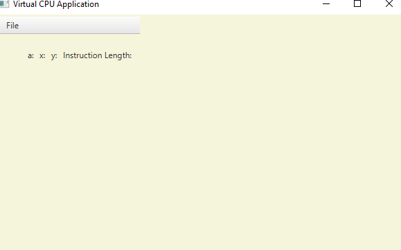

# VirtualCPU

A JavaFX program designed to parse and read assembly instructions similar to the ones for the 6502 chip. While not a
true emulator that I had some interest in trying to make; it does read files and perform operations on internal
registers. Users can open handmade instructions on their computer ,and reach one sequentially to see what would happen.

## What does it do exactly?

For now, it lets you read and insert values into three different registers ('a','x', and 'y') with various commands. It
also has an internal memory represented by a 256 byte array. All numbers are assumed to be in hex.

The commands are:

* BRK - Cease Execution
* LDA - Load a value into register A
* ADC - Add a value to register A
* STA - Store the value of register A into the memory location specified by
* the value in the next memory address.
* INX - Increment the value of the X register
* LDX - Load a value into register X
* BNE - Branch if not equal (not actually fully implemented yet)
* STA_X - Store the value in the A register in the memory location pointed to by the X register.
* DEY - Decrement the value in the X register
* LDY - Load the value in the next memory address into register Y

## What does it look like?

It consists of a humble menu bar and four labels. At this current time; a table with the values from the memory byte
array seems highly unlikely as an array of 256 positions each with a value and position would take up an excessive
amount of space in JavaFX.

## Built With

* [JavaFX](https://openjfx.io/openjfx-docs/) - The view framework used
* [Gradle](https://gradle.org/) - Dependency Management
* [Log4J 2](https://logging.apache.org/log4j/2.x/) - Logging
* [JUnit 5](https://junit.org/junit5/docs/current/user-guide/) - Testing

#### Didn't Log4J have an exploit?

Post 2.16 versions have the bug discovered in December 2021 removed.

## Testing

A few sample command files were provided to test simpler commands such as the ability to load values, add, increment,
and decrement.

Reflection was also used to check if numbers could correctly be retrieved.

## Authors

* **Aaron Cottrill** - *Initial work* - [a2937](https://github.com/a2937)

## Versioning

We use [SemVer](http://semver.org/) for versioning. For the versions available, see
the [tags on this repository](https://github.com/a2937/VirtualCPU/tags).

## Deployment

Use the "jlink" gradle task to build a deployable version of this program. This is because of Java 11's module based
system. The JLink task modifies the Java Runtime environment in order to add the JavaFX dependencies back where they
belong. Log4J unfortunately did not use the dependency module setup and was unfortunately difficult to deal with.

## License

This project is licensed under the MIT License - see the [LICENSE.md](LICENSE) file for details

## Acknowledgments

* My father for explaining his *actual* arcade emulators worked along with CPUs
